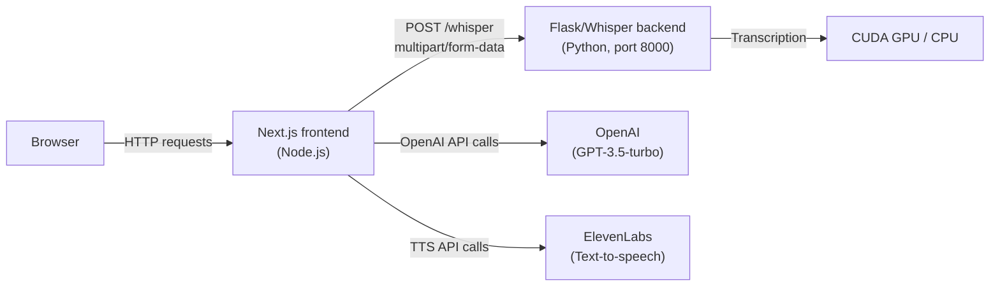

elitecode consists of two independently deployable components: a **Next.js frontend** and a **Flask/Whisper backend**. Self-hosting lets you run the Whisper speech recognition model on your own hardware, keeping audio data private and taking advantage of local GPU acceleration.

## Architecture

### Next.js frontend

The frontend is a standard Next.js 14 application. It handles the user interface, routes audio recordings to the Whisper backend for transcription, and calls the OpenAI and ElevenLabs APIs for feedback and text-to-speech.

### Flask/Whisper backend

The backend is a Python Flask application that wraps OpenAI's Whisper model. It exposes a single `POST /whisper` endpoint that accepts audio file uploads and returns transcriptions. Because Whisper runs in-process, no audio data leaves your infrastructure.

**Why a separate backend?** Whisper is a large PyTorch model that requires Python and optionally CUDA. Keeping it in a separate service lets the Next.js frontend remain a lightweight Node.js process while the backend can be scaled, GPU-equipped, or containerized independently.

## Requirements

| Component | Requirement |
|-----------|-------------|
| Node.js | 18 or later |
| Python | 3.8 or later |
| pip | Latest stable |
| ffmpeg | Required by Whisper for audio decoding |
| CUDA GPU | Optional, but recommended for fast transcription |
| Docker | Optional, for containerized deployment |
| Kubernetes | Optional, for orchestrated deployment |

### API keys

You need accounts and API keys for the following services:

- **OpenAI** — used for GPT-3.5-turbo feedback on explanations
- **ElevenLabs** — used for text-to-speech audio responses

<Note>
The Whisper transcription model runs entirely on your own hardware. No audio is sent to OpenAI's servers.
</Note>

## Self-hosting guides

<CardGroup cols={3}>
  <Card title="Environment variables" icon="key" href="/self-hosting/environment-variables">
    Configure API keys and backend URL for both local and production environments.
  </Card>
  <Card title="Whisper backend" icon="microphone" href="/self-hosting/whisper-backend">
    Set up and run the Flask/Whisper transcription backend locally or with Docker.
  </Card>
  <Card title="Deployment" icon="rocket" href="/self-hosting/deployment">
    Deploy the full stack with Docker, Kubernetes, or Vercel.
  </Card>
</CardGroup>
